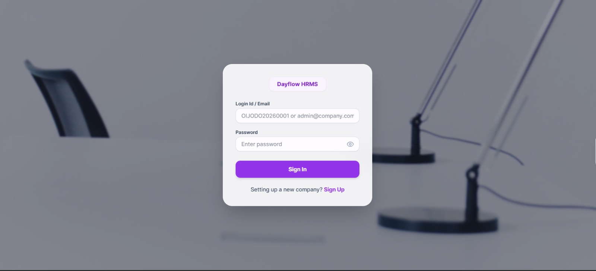
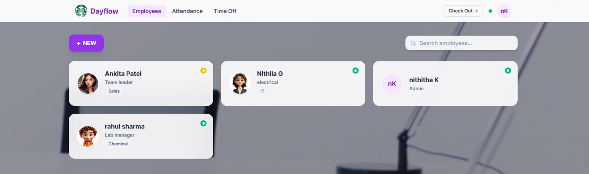
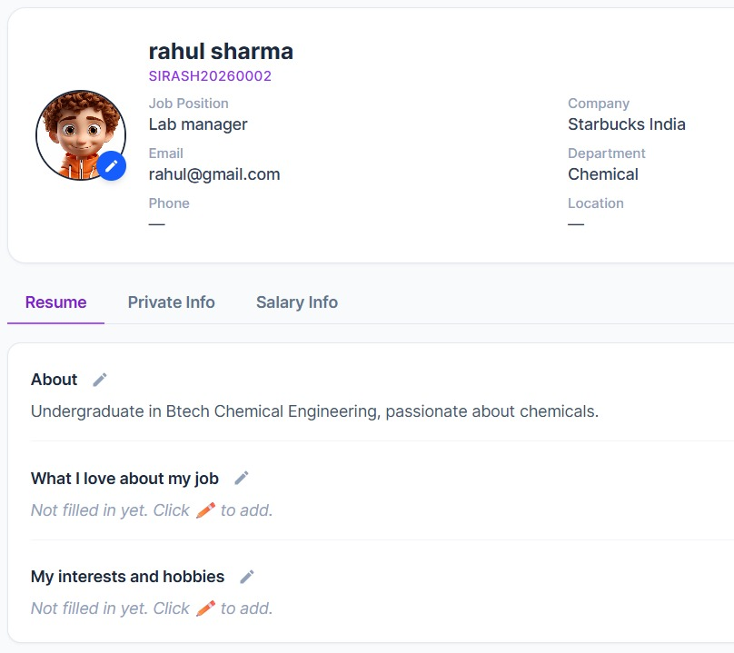
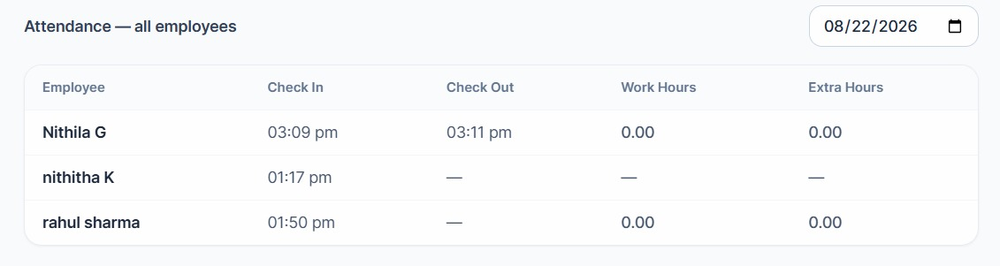
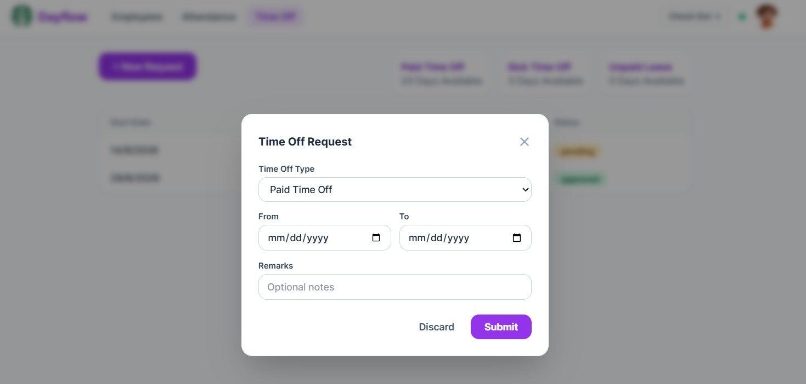
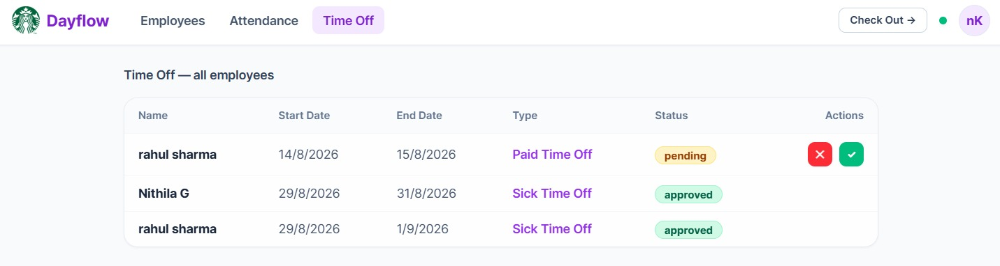

<div align="center">

# 🌊 Dayflow HRMS

### Every workday, perfectly aligned.

A full-stack Human Resource Management System built for the **Odoo Hackathon** — real-time attendance tracking, leave workflows, employee profiles, and automatic salary computation. Clean, fast, and ready for teams of any size.

[](https://react.dev)
[](https://tailwindcss.com)
[](https://nodejs.org)
[](https://postgresql.org)
[](https://socket.io)
[](https://docker.com)

[🎬 Watch Demo](https://www.loom.com/share/f4ed0843c2594c0cb14c8f8cacd1df26) · [📦 GitHub Repo](https://github.com/Nithila-G/Odoo-Hackathon-Dayflow)

</div>

---

## What This Is

Managing a team shouldn't mean juggling spreadsheets for attendance, chasing emails for leave approvals, or manually computing salary breakdowns every month. **Dayflow** brings it all into one place.

Built from scratch in under 48 hours for the Odoo Hackathon, Dayflow is a production-ready HRMS that handles the full employee lifecycle — from onboarding a new company to approving a sick leave request — with a real-time presence system, auto-generated employee IDs, and a salary calculator that does the maths so you don't have to.

---

## Key Features

**🏢 Company Onboarding & Authentication**
- Multi-company sign-up with live logo upload and preview.
- Auto-generated login IDs (e.g. `SINIK20260001`) on employee creation.
- Secure password fields with eye-toggle visibility control.
- HD Pexels video background with glassmorphism card UI.



---

**👥 Employee Directory**
- Card grid view showing avatars, job positions, and department tags.
- Live Socket.io presence indicators — 🟢 Present, ✈️ On Leave, 🟡 Absent — updated in real time across all sessions.
- Searchable employee list with a **+ NEW** quick-add button.



---

**🪪 Rich Employee Profiles**
- Avatar upload, personal bio, and editable resume sections.
- Interactive skill pills and certifications with add / delete controls.
- Tabs for Resume, Private Info, and Salary Info — each independently editable.



---

**🕐 Live Attendance Tracking**
- One-click Check In / Check Out from the header bar.
- Admin attendance table shows check-in time, check-out time, total work hours, and extra hours per employee per day.
- Date picker to view any historical day's attendance snapshot.



---

**🌴 Time Off & Leave Approval Workflow**
- Employees submit leave requests with type (Paid / Sick / Unpaid), date range, and optional remarks.
- Medical attachment upload support for sick leave.
- Admin dashboard shows all pending requests with one-click approve ✅ or reject ❌ actions.
- Status badges update live: `pending` → `approved` / `rejected`.





---

**💰 Automatic Salary Component Calculator**
Enter a monthly wage once — Dayflow breaks it down instantly:

| Component | Calculation |
|:---|:---|
| Basic | 50% of Monthly Wage |
| HRA | 50% of Basic |
| Standard Allowance | 16.67% of Basic |
| Performance Bonus | 8.33% of Basic |
| LTA | 8.33% of Basic |
| Fixed Allowance | Remainder |
| Provident Fund (PF) | 12% — Employee & Employer |
| Professional Tax | ₹200 fixed |

---

## Architecture

A clean client–server split. The frontend never talks to the database directly; everything goes through the Express API. Socket.io sits on the same Express server and emits presence events to every connected client the moment someone checks in or out.

```
Client (React + Vite + Tailwind)
        │
        │  REST API calls + Socket.io events
        ▼
Server (Express + Socket.io)
        │
        │  SQL queries via migrations
        ▼
PostgreSQL (embedded via start-postgres.js, or Docker Compose)
```

---

## Project Structure

```
dayflow/
├── client/                  # React (Vite) + Tailwind CSS Frontend
│   ├── public/videos/       # HD Background Video Assets
│   └── src/
│       ├── components/      # NavBar, AppLayout, BackgroundVideo, SalaryTab
│       ├── pages/           # SignIn, SignUp, Employees, Profile, Attendance, TimeOff
│       └── utils/           # Date & Time Utility Helpers
├── server/                  # Express API + PostgreSQL Backend
│   ├── migrations/          # 001_init.sql Database Schema
│   ├── start-postgres.js    # Embedded Postgres Launcher (no Docker needed)
│   └── src/
│       ├── middleware/      # Auth & Role Enforcement
│       └── routes/          # Auth, Employees, Attendance, Leave, Salary, Health
├── docs/                    # PRD and System Architecture Documents
├── docker-compose.yml
└── README.md
```

---

## Local Setup

### Prerequisites
- **Node.js** v18+ or v20+

---

### Option A — Standard Run (No Docker Required)

#### 1. Start the Database

Open a terminal in the project root:

```bash
node server/start-postgres.js
```

This boots an embedded PostgreSQL instance on `localhost:5432`, creates the `dayflow` database, and runs all schema migrations automatically.

#### 2. Start the Backend

```bash
cd server
npm install
npm run dev
```

Backend runs at `http://localhost:4000`. Health check: `http://localhost:4000/api/health`

#### 3. Start the Frontend

```bash
cd client
npm install
npm run dev
```

Frontend runs at `http://localhost:5173`.

---

### Option B — Docker Compose

```bash
# 1. Start Postgres
docker compose up -d

# 2. Start backend
cd server && npm install && npm run dev

# 3. Start frontend
cd client && npm install && npm run dev
```

---

## Demo

▶️ **[Watch the full walkthrough on Loom](https://www.loom.com/share/f4ed0843c2594c0cb14c8f8cacd1df26)**

The demo covers company sign-up, employee creation with auto-generated IDs, live check-in / check-out with real-time presence dots, leave request and admin approval flow, and the salary calculator.

---

## Team

Built with ❤️ for the **Odoo Hackathon** by Team Dayflow:

| Member | GitHub |
|:---|:---|
| Nithila G | [@Nithila-G](https://github.com/Nithila-G) |
| Tharunika | [@tharunikanagendran](https://github.com/tharunikanagendran) |
| Rahul | [@Rahul-1812](https://github.com/Rahul-1812) |
| Nithitha K | [@nithi-05K](https://github.com/nithi-05K) |

---

<div align="center">

Built for the Odoo Hackathon 2026.

</div>
